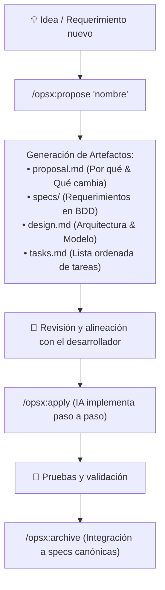

# OpenSpec Intro: Aprende Spec-Driven Development con IA

¡Bienvenido a **OpenSpec Intro**! Este proyecto tiene como objetivo enseñar a desarrolladores y equipos cómo utilizar **[OpenSpec](https://github.com/Fission-AI/OpenSpec)** junto con herramientas de Inteligencia Artificial avanzadas (como **Antigravity** / `agy`) para construir software de manera profesional, estructurada y predecible.

En lugar de programar mediante prueba y error (*prompt & pray*), aquí aprenderás el enfoque **Desarrollo Guiado por Especificaciones (Spec-Driven Development / SDD)**: la IA planifica, especifica y diseña contigo antes de escribir código.

---

## 📚 Guías Iniciales del Repositorio

Para comenzar desde cero, consulta las guías preparadas en este repositorio:

1. 💻 **[01. Instalación de WSL2, Antigravity (`agy`), OpenSpec y Docker](docs/01-instalacion-wsl2-antigravity-docker.md)**:
   - Configuración de Ubuntu sobre WSL2 en Windows 10/11.
   - Instalación de Node.js LTS mediante `nvm`.
   - Configuración del CLI de IA (**Antigravity `agy`**).
   - Instalación global de la CLI de **OpenSpec** (`@fission-ai/openspec`).
   - Configuración de **Docker** (vía Docker Desktop o Docker Engine nativo en WSL2).

2. 🚀 **[02. Inicialización y Flujo de Trabajo con OpenSpec y Antigravity](docs/02-inicializacion-openspec-antigravity.md)**:
   - Cómo inicializar un repositorio con `openspec init --tools antigravity`.
   - Explicación detallada de directorios (`openspec/`, `.agent/workflows/`, `.agent/skills/`).
   - Uso de slash commands en Antigravity (`/opsx:propose`, `/opsx:apply`, `/opsx:archive`).
   - Ciclo de vida de un cambio (`proposal.md` ➔ `specs/` ➔ `design.md` ➔ `tasks.md`).

3. 🗺️ **[03. Hoja de Ruta de Ejemplos: Sistema de Inventario Progresivo](docs/03-hoja-de-ruta-ejemplos-inventario.md)**:
   - Visión general de los 4 proyectos de ejemplo que se desarrollarán incrementalmente a través de cambios de OpenSpec.

---

## 🧭 ¿Cómo Funciona OpenSpec?

OpenSpec introduce un flujo de trabajo estructurado en el que los requerimientos de tu aplicación evolucionan a través de **propuestas de cambio** (*changes*):

---

## 📦 Casos de Ejemplo Implementados como Cambios OpenSpec

Para que tus amigos vean el poder de OpenSpec en acción, modelamos una evolución realista de un producto comercial dividida en 4 fases incrementales, todas disponibles en `openspec/changes/`:

1. 🏬 **[Fase 1: Sistema de Control de Inventario Monolocal (Base)](openspec/changes/inventario-monolocal-base)**
   - Catálogo de productos (SKU, nombre, precio de costo, precio venta).
   - Registro de entradas, salidas y ajustes manuales de stock en una única sucursal.
   - Kardex e historial cronológico inmutable de movimientos.
   - 📂 Artefactos: [proposal.md](openspec/changes/inventario-monolocal-base/proposal.md) | [specs/](openspec/changes/inventario-monolocal-base/specs) | [design.md](openspec/changes/inventario-monolocal-base/design.md) | [tasks.md](openspec/changes/inventario-monolocal-base/tasks.md)

2. 💳 **[Fase 2: Inventario Monolocal + Punto de Venta (POS) + Multivendedor](openspec/changes/ventas-pos-multivendedor)**
   - Módulo de ventas segregado del módulo de inventario.
   - Operación por múltiples vendedores con caja asignada.
   - Restricción estricta de seguridad: los vendedores **no** pueden modificar stock directamente; el stock se descuenta automáticamente con cada venta realizada y aprobada.
   - 📂 Artefactos: [proposal.md](openspec/changes/ventas-pos-multivendedor/proposal.md) | [specs/](openspec/changes/ventas-pos-multivendedor/specs) | [design.md](openspec/changes/ventas-pos-multivendedor/design.md) | [tasks.md](openspec/changes/ventas-pos-multivendedor/tasks.md)

3. 🏢 **[Fase 3: Inventario Multi-local + Multivendedor + Roles + Quiebres de Stock](openspec/changes/inventario-multilocal-roles-quiebres)**
   - Gestión de múltiples bodegas/sucursales con stock independiente.
   - Sistema de roles (RBAC): *Administrador*, *Encargado de Inventario*, *Vendedor*.
   - Módulo de alerta y reporte de quiebre de stock (al alcanzar el umbral mínimo por sucursal).
   - 📂 Artefactos: [proposal.md](openspec/changes/inventario-multilocal-roles-quiebres/proposal.md) | [specs/](openspec/changes/inventario-multilocal-roles-quiebres/specs) | [design.md](openspec/changes/inventario-multilocal-roles-quiebres/design.md) | [tasks.md](openspec/changes/inventario-multilocal-roles-quiebres/tasks.md)

4. 🚚 **[Fase 4 (Módulo afín): Sistema de Compras, Proveedores y Reabastecimiento Automático](openspec/changes/compras-reabastecimiento-proveedores)**
   - Directorio de proveedores y catálogo de precios de compra con *lead time*.
   - Generación automática de Órdenes de Compra (PO) en borrador cuando un producto entra en quiebre de stock.
   - Recepción física de mercadería con actualización automática de existencias en almacén.
   - 📂 Artefactos: [proposal.md](openspec/changes/compras-reabastecimiento-proveedores/proposal.md) | [specs/](openspec/changes/compras-reabastecimiento-proveedores/specs) | [design.md](openspec/changes/compras-reabastecimiento-proveedores/design.md) | [tasks.md](openspec/changes/compras-reabastecimiento-proveedores/tasks.md)

---

## ⚡ Comandos Rápidos de Referencia

| Acción | Comando CLI | Slash Command en Antigravity |
| :--- | :--- | :--- |
| Inicializar OpenSpec | `openspec init --tools antigravity` | — |
| Crear nueva propuesta | `openspec new change <nombre>` | `/opsx:propose <idea>` |
| Consultar estado | `openspec status --change <nombre>` | — |
| Validar especificaciones | `openspec validate --all` | — |
| Ver dashboard interactivo | `openspec view` | — |
| Aplicar tareas del cambio | — | `/opsx:apply` |
| Archivar cambio completado | `openspec archive <nombre>` | `/opsx:archive` |

---

## 👥 Colaboración y Reglas

- Las modificaciones y nuevas características deben plantearse primero como un cambio en OpenSpec.
- Los contenedores y servicios con Docker son compilados y levantados manualmente por el desarrollador para mantener control total sobre los puertos y dependencias locales.
