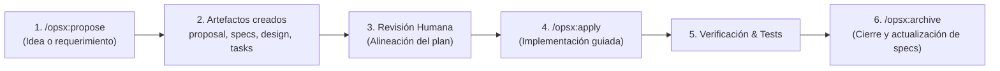

# Guía: Cómo Inicializar y Usar un Repositorio con OpenSpec y Antigravity

Esta guía explica en detalle cómo inicializar un nuevo proyecto configurado para **OpenSpec** utilizando **Antigravity** como herramienta de IA asistida, y cómo aprovechar el flujo de **Desarrollo Guiado por Especificaciones (Spec-Driven Development / SDD)**.

---

## 1. ¿Qué es OpenSpec y por qué usarlo con Antigravity?

Cuando desarrollamos con asistentes de Inteligencia Artificial tradicionales, solemos caer en el *"prompt & pray"* (dar instrucciones sueltas esperando que el modelo acierte). Esto suele provocar:
- Pérdida de contexto en proyectos grandes.
- Funcionalidades previas que se rompen al agregar nuevas.
- Tareas a medio terminar sin trazabilidad.

**OpenSpec** resuelve esto organizando el ciclo de vida del software en **especificaciones vivas y cambios incrementales**:
1. **Antes de escribir código**, se define el **Por qué** (`proposal.md`), los **Requerimientos** (`specs/`), el **Cómo técnico** (`design.md`) y la lista ordenada de pasos (`tasks.md`).
2. El agente de IA (Antigravity) trabaja sobre una lista de tareas acordada, garantizando precisión.
3. Una vez implementado y probado, el cambio se archiva y pasa a formar parte de la especificación permanente del proyecto.

---

## 2. Paso a Paso: Inicializar un Repositorio

### Paso 2.1: Crear la carpeta y el repositorio Git

OpenSpec trabaja de la mano con el control de versiones (Git). En tu terminal de Linux (WSL2):

```bash
# 1. Crea la carpeta de tu nuevo proyecto y entra en ella
mkdir mi-proyecto && cd mi-proyecto

# 2. Inicializa el repositorio Git
git init -b main
```

### Paso 2.2: Ejecutar el comando de inicialización para Antigravity

Ejecuta el CLI de OpenSpec indicando que tu herramienta de IA es `antigravity`:

```bash
openspec init --tools antigravity
```

Verás una salida similar a la siguiente:
```text
- Creating OpenSpec structure...
▌ OpenSpec structure created
- Setting up Antigravity...
✔ Setup complete for Antigravity

OpenSpec Setup Complete

Created: Antigravity
6 skills and 6 commands in .agent/
Config: openspec/config.yaml (schema: spec-driven)

Getting started:
  Start your first change: /opsx:propose "your idea"
```

---

## 3. Anatomía de lo que se genera en el proyecto

Al ejecutar la inicialización, OpenSpec crea dos directorios principales:

### A. Directorio `openspec/`
Es el núcleo de tus especificaciones:
```text
openspec/
├── config.yaml          # Configuración del esquema, contexto del proyecto y reglas
├── specs/               # Especificaciones canónicas del sistema (fuente de la verdad)
└── changes/             # Propuestas de cambio activas
    └── archive/         # Registro histórico de cambios completados
```

- **`openspec/config.yaml`**: Permite indicarle al agente el contexto del proyecto (stack tecnológico, convenciones de código, lenguaje) y reglas que debe cumplir al redactar especificaciones o tareas.
- **`openspec/specs/`**: Contiene carpetas para cada capacidad o módulo del sistema (`auth/spec.md`, `inventory/spec.md`, etc.).
- **`openspec/changes/<nombre-del-cambio>/`**: Cada cambio en desarrollo vive en una subcarpeta propia con sus 4 artefactos (`proposal.md`, `specs/`, `design.md`, `tasks.md`).

### B. Directorio `.agent/` (Integración nativa con Antigravity)
Contiene las definiciones que Antigravity lee para habilitar comandos rápidos (*slash commands*) y habilidades (*skills*):

```text
.agent/
├── workflows/
│   ├── opsx-propose.md  # Slash command: /opsx:propose
│   ├── opsx-apply.md    # Slash command: /opsx:apply
│   ├── opsx-archive.md  # Slash command: /opsx:archive
│   ├── opsx-explore.md  # Slash command: /opsx:explore
│   ├── opsx-sync.md     # Slash command: /opsx:sync
│   └── opsx-update.md   # Slash command: /opsx:update
└── skills/
    ├── openspec-propose/
    ├── openspec-apply-change/
    ├── openspec-archive-change/
    ├── openspec-explore/
    ├── openspec-sync-specs/
    └── openspec-update-change/
```

> [!NOTE]
> Gracias a estos archivos, en la interfaz de chat o CLI de Antigravity puedes escribir directamente `/opsx:propose "mi idea"` y el agente sabrá exactamente qué hacer siguiendo el estándar de OpenSpec.

---

## 4. El Ciclo de Vida de OpenSpec (Flujo de Trabajo)

El flujo de trabajo estándar en OpenSpec sigue el esquema **`spec-driven`**:



### 1. Proponer un cambio (`/opsx:propose`)
En Antigravity escribes:
```text
/opsx:propose "crear sistema de inventario monolocal"
```
El agente creará la carpeta `openspec/changes/<nombre>/` y redactará:
- **`proposal.md`**: ¿Por qué se hace este cambio? ¿Qué capacidades nuevas o modificadas introduce? ¿Qué impacto tiene?
- **`specs/<capacidad>/spec.md`**: Requerimientos funcionales escritos en formato BDD:
  ```markdown
  ### Requirement: Registrar nuevo producto
  El sistema debe permitir dar de alta un producto con código SKU, nombre y stock inicial.

  #### Scenario: Registro exitoso
  - **WHEN** se envía un SKU único y cantidad >= 0
  - **THEN** el producto se almacena y se registra el movimiento de inventario inicial.
  ```
- **`design.md`**: Arquitectura, modelo de base de datos, endpoints o interfaces, decisiones clave y análisis de riesgos.
- **`tasks.md`**: Lista ordenada de tareas atómicas (`- [ ] 1.1 Crear migración de base de datos`, etc.).

### 2. Revisión y ajuste
Antes de que se toque una sola línea de código fuente, tú como desarrollador revisas los archivos generados. Puedes pedirle al agente:
*"En `design.md`, usemos PostgreSQL en lugar de SQLite"* o *"Agrega una tarea en `tasks.md` para escribir pruebas unitarias de quiebre de stock"*.

### 3. Implementación (`/opsx:apply`)
Una vez aprobado el plan, le indicas a Antigravity:
```text
/opsx:apply
```
El agente leerá `tasks.md`, implementará el código tarea por tarea, marcará los checkboxes completados (`[x]`) y comprobará que los requerimientos se cumplan.

### 4. Archivar el cambio (`/opsx:archive`)
Cuando todas las tareas estén completadas y probadas:
```text
/opsx:archive <nombre-del-cambio>
```
OpenSpec:
1. Mueve el cambio a `openspec/changes/archive/`.
2. Integra los requerimientos nuevos a las especificaciones vivas en `openspec/specs/`.
3. Tu repositorio queda limpio y listo para el siguiente cambio.

---

## 5. Comandos útiles de la CLI de OpenSpec

Puedes ejecutar estos comandos en cualquier momento desde tu terminal:

| Comando | Descripción |
| :--- | :--- |
| `openspec list` | Lista los cambios activos en el proyecto. |
| `openspec list --specs` | Lista todas las especificaciones canónicas registradas. |
| `openspec status --change <nombre>` | Muestra el estado de completitud de los artefactos de un cambio. |
| `openspec validate --all` | Valida que todos los archivos cumplan con el formato y esquema esperado. |
| `openspec view` | Abre un panel interactivo TUI (terminal UI) con el resumen de specs y cambios. |
| `openspec doctor` | Comprueba la integridad de enlaces y estado del entorno OpenSpec. |

---

## 6. Personalizar el Contexto del Proyecto (`openspec/config.yaml`)

Para que Antigravity entienda tus preferencias tecnológicas sin necesidad de recordárselo en cada conversación, puedes editar `openspec/config.yaml`:

```yaml
schema: spec-driven

context: |
  Stack tecnológico preferido:
  - Backend: Node.js / TypeScript con Fastify o Express (o Python con FastAPI)
  - Base de datos: PostgreSQL con Prisma u ORM equivalente
  - Pruebas: Vitest o Jest
  - Arquitectura: Capas limpias (Controlador -> Servicio -> Repositorio)

rules:
  proposal:
    - Explicar siempre el impacto en la experiencia de usuario y en la base de datos.
  specs:
    - Incluir escenarios para casos de error y validaciones de entrada.
  tasks:
    - Incluir una tarea de verificación y pruebas para cada bloque de funcionalidad.
```

¡Con esta configuración, cada vez que uses `/opsx:propose`, Antigravity generará propuestas alineadas perfectamente a tus reglas!
