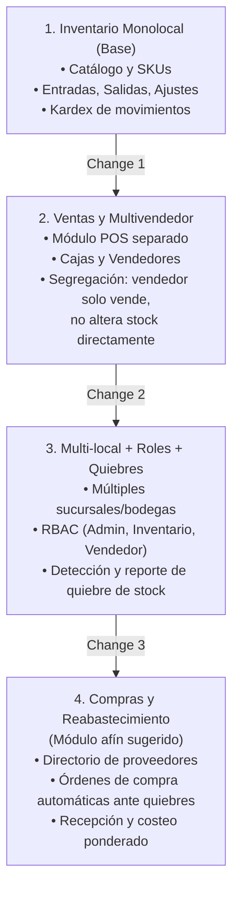

# Hoja de Ruta: Ejemplos Evolutivos de Sistema de Inventario con OpenSpec

Uno de los mayores desafíos al enseñar desarrollo con IA es mostrar cómo un sistema crece sin volverse caótico ni romper lo que ya funcionaba. **OpenSpec** brilla precisamente en este escenario gracias a su modelo de **especificaciones vivas y cambios incrementales**.

Esta guía presenta la arquitectura funcional y de requerimientos para los **4 proyectos de ejemplo**, diseñados como una evolución natural de un sistema comercial.

---

## 🏗️ Visión General de la Progresión



---

## 1. Proyecto 1: Sistema de Control de Inventario Monolocal (Base)

### Propósito
Gestionar de manera precisa la existencia física de mercadería en una sola tienda o bodega central.

### Capacidades (`specs/`)
- `product-catalog`: Creación, edición, categorización y consulta de productos con código SKU, código de barras, descripción y costo base.
- `inventory-tracking`: Registro de saldo actual de inventario y trazabilidad histórica de movimientos.

### Estructura de Artefactos OpenSpec
- **`proposal.md`**:
  - *Why*: Falta de visibilidad sobre el stock actual de la tienda y pérdidas no registradas de mercadería.
  - *What Changes*: Creación de la capa base de datos de productos y auditoría de movimientos.
  - *Capabilities*: `product-catalog` (nueva), `inventory-tracking` (nueva).
- **`specs/product-catalog/spec.md`**:
  - `Requirement: Alta de producto con SKU único`:
    - `Scenario: SKU duplicado rechazado`: **WHEN** se intenta registrar un SKU existente, **THEN** el sistema retorna error `409 Conflict`.
  - `Requirement: Consulta de stock disponible`:
    - `Scenario: Stock en tiempo real`: **WHEN** se consulta el SKU, **THEN** devuelve la cantidad disponible calculada.
- **`specs/inventory-tracking/spec.md`**:
  - `Requirement: Registro de movimiento de inventario`:
    - `Scenario: Entrada por compra`: **WHEN** se ingresa tipo `ENTRY` con cantidad `N`, **THEN** el stock aumenta en `N` y se guarda en el kardex con fecha y motivo.
    - `Scenario: Ajuste por merma o pérdida`: **WHEN** se ingresa tipo `ADJUSTMENT`, **THEN** se actualiza el saldo registrando justificación obligatoria.
- **`design.md`**:
  - Base de datos relacional con tablas: `products`, `inventory_movements` (id, product_id, type [ENTRY, EXIT, ADJUSTMENT], quantity, reason, created_at).
  - Transacciones ACID para evitar inconsistencias en el recuento.
- **`tasks.md`**:
  - 1.1 Diseñar esquema de base de datos (`products`, `inventory_movements`).
  - 1.2 Implementar servicio de catálogo de productos con validación de SKU.
  - 1.3 Implementar servicio de movimientos de inventario con balance transaccional.
  - 1.4 Pruebas unitarias y de integración para entradas, salidas y ajustes.

---

## 2. Proyecto 2: Inventario Monolocal + Sistema de Ventas y Multivendedor

### Propósito
Permitir que múltiples vendedores registren ventas en el punto de atención (POS) sin tener acceso a manipular el stock directamente. Cada venta descuenta el inventario de forma automática y atómica.

### Capacidades (`specs/`)
- `sales-pos`: Módulo exclusivo para vendedores con catálogo de venta, carrito, selección de medio de pago y generación de comprobante.
- `vendor-isolation`: Separación estricta de privilegios: un vendedor no ve costos de compra ni puede editar inventario directamente; solo registra transacciones de venta.
- `inventory-tracking` *(Modificada)*: Se añade el tipo de movimiento `SALE` generado exclusivamente por el subsistema de ventas.

### Estructura de Artefactos OpenSpec
- **`proposal.md`**:
  - *Why*: La tienda comienza a atender público masivo con varios empleados. Si los vendedores pudieran editar inventario a mano, se prestaría para mermas no autorizadas.
  - *What Changes*: Nueva interfaz de punto de venta (POS) y aislamiento de permisos por token de vendedor.
  - *Capabilities*: `sales-pos` (nueva), `vendor-isolation` (nueva), `inventory-tracking` (modificada).
- **`specs/sales-pos/spec.md`**:
  - `Requirement: Registro de ticket de venta`:
    - `Scenario: Venta exitosa con stock suficiente`: **WHEN** un vendedor registra una venta con productos que tienen stock >= cantidad vendida, **THEN** se emite el ticket, el estado queda `PAID` y se emite evento de descuento de inventario.
    - `Scenario: Rechazo por stock insuficiente`: **WHEN** la cantidad solicitada supera el stock disponible, **THEN** la venta se cancela indicando el producto sin disponibilidad.
- **`specs/vendor-isolation/spec.md`**:
  - `Requirement: Bloqueo de operaciones de inventario a vendedores`:
    - `Scenario: Intento de ajuste manual por vendedor`: **WHEN** un usuario con perfil vendedor intenta llamar al endpoint `/inventory/adjustment`, **THEN** el sistema responde `403 Forbidden`.
- **`design.md`**:
  - Separación de vistas de frontend: `/pos` (interfaz ligera para ventas rápidas con código de barras) vs `/admin/inventory` (interfaz de almacén protegida).
  - Bloqueo pesimista o transaccional a nivel de base de datos (`SELECT FOR UPDATE`) para evitar condiciones de carrera cuando dos vendedores intentan vender la última unidad disponible al mismo tiempo.
- **`tasks.md`**:
  - 2.1 Crear modelo de datos para `sales`, `sale_items` y `vendors`.
  - 2.2 Implementar middleware de autenticación y autorización para vendedores.
  - 2.3 Implementar endpoint transaccional de venta que bloquee filas y descuente stock.
  - 2.4 Desarrollar vista de venta (POS) separada de la vista de inventario.
  - 2.5 Escribir tests de concurrencia simulando dos vendedores vendiendo el mismo ítem simultáneamente.

---

## 3. Proyecto 3: Inventario Multi-local + Multivendedor + Roles (Admin, Inventario, Vendedor) + Quiebres de Stock

### Propósito
Escalar el negocio a múltiples sucursales o almacenes (ej. Sucursal Centro, Sucursal Norte, Bodega Central) con control de acceso basado en roles (RBAC) y un sistema automático de detección y reporte de quiebre de stock.

### Capacidades (`specs/`)
- `multi-location`: Asociación de stock a ubicaciones físicas independientes.
- `rbac-auth`: Control de roles con privilegios diferenciados:
  - **Administrador**: Control total del sistema, sucursales y usuarios.
  - **Encargado de Inventario**: Entradas, salidas, traslados y ajustes de inventario de sus sucursales asignadas; no emite tickets de venta.
  - **Vendedor**: Solo ventas en la sucursal asignada a su turno.
- `stockout-alerts`: Monitoreo continuo de niveles de stock vs umbrales mínimos (`min_threshold`) por sucursal y reporte exportable en tiempo real.

### Estructura de Artefactos OpenSpec
- **`proposal.md`**:
  - *Why*: La empresa abrió dos nuevas sucursales. El stock no puede consolidarse en una sola cifra y se producen quiebres de producto no detectados que detienen las ventas.
  - *What Changes*: Modelo de stock multidimensional `(product_id, location_id)`, roles jerárquicos y motor de alertas de quiebre.
  - *Capabilities*: `multi-location` (nueva), `rbac-auth` (nueva), `stockout-alerts` (nueva), `product-catalog` (modificada).
- **`specs/multi-location/spec.md`**:
  - `Requirement: Stock por ubicación`:
    - `Scenario: Consulta de stock en sucursal específica`: **WHEN** se consulta el producto en `location_A`, **THEN** muestra solo las unidades físicas ubicadas en dicha sucursal.
- **`specs/stockout-alerts/spec.md`**:
  - `Requirement: Detección de quiebre de stock`:
    - `Scenario: Alerta cuando stock cae bajo el mínimo`: **WHEN** una venta o salida hace que el stock en la sucursal sea `<= min_threshold`, **THEN** el sistema genera una alerta con prioridad `HIGH` en el panel de inventario.
  - `Requirement: Reporte consolidado de quiebres`:
    - `Scenario: Generación de reporte para administradores`: **WHEN** el administrador solicita el reporte de quiebres filtrado por sucursal, **THEN** el sistema entrega la lista de productos críticos con sus días estimados de agotamiento.
- **`specs/rbac-auth/spec.md`**:
  - `Requirement: Restricción de acceso por rol`:
    - `Scenario: Vendedor restringido a su sucursal`: **WHEN** un vendedor intenta vender desde una sucursal no asignada, **THEN** la operación es denegada con `403 Forbidden`.
- **`design.md`**:
  - Tablas: `locations`, `location_stock` (location_id, product_id, current_stock, min_threshold), `roles`, `users`, `stock_alerts`.
  - Mecanismo de eventos internos para evaluación asíncrona de umbrales tras cada movimiento de stock.
- **`tasks.md`**:
  - 3.1 Migración de base de datos para soporte multi-sucursal y stock por ubicación.
  - 3.2 Refactorizar lógica de descuento de stock para exigir `location_id`.
  - 3.3 Implementar sistema RBAC con 3 roles (Admin, Inventario, Vendedor) y asignación de sucursal.
  - 3.4 Implementar observador de quiebres de stock y generación de alertas.
  - 3.5 Crear endpoints y pantalla de reporte de quiebre de stock con filtros por sucursal.

---

## 4. Proyecto 4 (Afín Sugerido): Sistema de Compras, Proveedores y Reabastecimiento Automático

### Propósito (¿Por qué este proyecto completa el ciclo?)
Un reporte de quiebre de stock en el Proyecto 3 detecta el problema, pero **no lo soluciona**. El Proyecto 4 cierra el círculo comercial: conecta los quiebres de stock con el **Directorio de Proveedores** y genera **Órdenes de Compra y Reabastecimiento Automático** para reponer mercadería en las sucursales.

### Capacidades (`specs/`)
- `supplier-management`: Catálogo de proveedores, tiempos promedio de entrega (*lead time*), precios pactados y condiciones comerciales.
- `purchase-orders`: Emisión, aprobación, envío y seguimiento del estado de órdenes de compra (`DRAFT`, `SENT`, `PARTIALLY_RECEIVED`, `RECEIVED`, `CANCELLED`).
- `automated-replenishment`: Generación automática de borradores de orden de compra cuando una sucursal entra en quiebre de stock, calculando el lote óptimo de pedido (*punto de reorden*).

### Estructura de Artefactos OpenSpec
- **`proposal.md`**:
  - *Why*: Los encargados de inventario pierden horas calculando a mano cuánto pedir a cada proveedor cuando hay quiebres de stock.
  - *What Changes*: Subsistema de compras integrado que convierte alertas de quiebre en pedidos sugeridos para proveedores registrados.
  - *Capabilities*: `supplier-management` (nueva), `purchase-orders` (nueva), `automated-replenishment` (nueva), `inventory-tracking` (modificada para recepción de órdenes).
- **`specs/automated-replenishment/spec.md`**:
  - `Requirement: Sugerencia de compra ante quiebre`:
    - `Scenario: Generación automática de borrador de PO`: **WHEN** se dispara un evento de quiebre de stock y el producto tiene un proveedor preferido asignado, **THEN** el sistema crea un borrador de Orden de Compra por la cantidad `(max_stock - current_stock)`.
- **`specs/purchase-orders/spec.md`**:
  - `Requirement: Recepción de mercadería en almacén`:
    - `Scenario: Recepción total con actualización de stock y costo`: **WHEN** el encargado de inventario confirma la recepción física de la orden `PO-100`, **THEN** el stock de la sucursal de destino se incrementa automáticamente y se registra el movimiento de tipo `PURCHASE_RECEIPT`.
- **`design.md`**:
  - Tablas: `suppliers`, `product_suppliers` (product_id, supplier_id, cost_price, lead_time_days), `purchase_orders`, `purchase_order_items`.
  - Regla de negocio para actualización de precio medio ponderado (PMP) de inventario tras recepción de facturas de compra.
- **`tasks.md`**:
  - 4.1 Crear modelos de proveedores, precios pactados y órdenes de compra.
  - 4.2 Desarrollar el servicio de cálculo de reposición automática basado en alertas de quiebre.
  - 4.3 Implementar flujo de estados de la orden de compra y aprobación del Administrador.
  - 4.4 Implementar módulo de recepción física en sucursal con imputación directa al inventario.
  - 4.5 Pruebas de extremo a extremo: Venta provoca quiebre ➔ Se genera borrador de compra ➔ Se aprueba y recepciona ➔ El stock queda repuesto.

---

## 💡 Próximo Paso en OpenSpec

Para llevar cualquiera de estos ejemplos a la práctica usando la CLI de OpenSpec o Antigravity, el comando inicial es:

```text
/opsx:propose "crear sistema de inventario monolocal con catálogo y kardex"
```

El agente generará la carpeta en `openspec/changes/` con los cuatro artefactos listos para su revisión.
